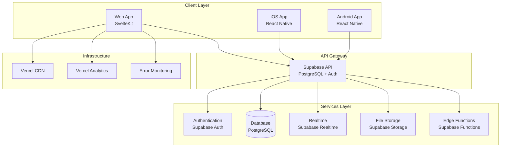

# Design Document

## Overview

Claude Code Korea는 한국의 Claude Code 사용자들을 위한 크로스 플랫폼 커뮤니티 플랫폼입니다. 웹 애플리케이션과 모바일 애플리케이션을 통해 일관된 사용자 경험을 제공하며, 실시간 소통, 코드 공유, 프로젝트 전시 등의 핵심 기능을 지원합니다.

### Architecture Philosophy

- **API-First Design**: 웹과 모바일이 동일한 API를 사용하여 일관성 보장
- **Real-time First**: Supabase Realtime을 활용한 실시간 협업 환경
- **Mobile-First UI**: 모바일 우선 설계로 모든 플랫폼에서 최적의 UX 제공
- **Scalable Backend**: Supabase BaaS를 활용한 확장 가능한 백엔드 아키텍처

## Architecture

### System Architecture



### Technology Stack

#### Web Application
- **Framework**: SvelteKit (SSR/SPA hybrid)
- **Styling**: Tailwind CSS + Skeleton UI
- **Code Editor**: Monaco Editor
- **Syntax Highlighting**: Shiki
- **Icons**: Lucide Svelte
- **State Management**: Svelte Stores
- **Build Tool**: Vite

#### Mobile Application
- **Framework**: React Native (Cross-platform)
- **Navigation**: React Navigation
- **State Management**: Zustand
- **UI Components**: NativeBase or Tamagui
- **Code Editor**: react-native-code-editor

#### Backend Services
- **Database**: Supabase PostgreSQL
- **Authentication**: Supabase Auth (OAuth + JWT)
- **Real-time**: Supabase Realtime (WebSocket)
- **File Storage**: Supabase Storage
- **Edge Functions**: Supabase Functions (Deno)

#### Infrastructure
- **Web Hosting**: Vercel
- **Mobile Distribution**: App Store + Google Play
- **CDN**: Vercel Edge Network
- **Analytics**: Vercel Analytics
- **Monitoring**: Sentry

## Components and Interfaces

### Core Components

#### 1. Authentication System

```typescript
interface AuthService {
  signInWithOAuth(provider: 'google' | 'github'): Promise<AuthResponse>
  signOut(): Promise<void>
  getCurrentUser(): Promise<User | null>
  updateProfile(profile: ProfileUpdate): Promise<Profile>
}

interface User {
  id: string
  email: string
  provider: string
  created_at: string
}

interface Profile {
  id: string
  username: string
  display_name?: string
  bio?: string
  avatar_url?: string
  github_username?: string
  created_at: string
  updated_at: string
}
```

#### 2. Forum System

```typescript
interface ForumService {
  getCategories(): Promise<Category[]>
  getPosts(categoryId?: string, page?: number): Promise<PostList>
  getPost(id: string): Promise<PostDetail>
  createPost(post: CreatePostRequest): Promise<Post>
  updatePost(id: string, post: UpdatePostRequest): Promise<Post>
  deletePost(id: string): Promise<void>
}

interface Post {
  id: string
  author_id: string
  author: Profile
  category_id: string
  category: Category
  title: string
  content: string
  tags: string[]
  is_pinned: boolean
  is_locked: boolean
  view_count: number
  like_count: number
  comment_count: number
  created_at: string
  updated_at: string
}

interface Category {
  id: string
  name: string
  description: string
  slug: string
  icon: string
  order_index: number
}
```

#### 3. Comment System

```typescript
interface CommentService {
  getComments(postId: string): Promise<Comment[]>
  createComment(comment: CreateCommentRequest): Promise<Comment>
  updateComment(id: string, content: string): Promise<Comment>
  deleteComment(id: string): Promise<void>
}

interface Comment {
  id: string
  author_id: string
  author: Profile
  post_id: string
  parent_id?: string
  content: string
  is_edited: boolean
  like_count: number
  replies?: Comment[]
  created_at: string
  updated_at: string
}
```

#### 4. Code Snippet System

```typescript
interface CodeService {
  getSnippets(page?: number, language?: string): Promise<SnippetList>
  getSnippet(id: string): Promise<CodeSnippet>
  createSnippet(snippet: CreateSnippetRequest): Promise<CodeSnippet>
  updateSnippet(id: string, snippet: UpdateSnippetRequest): Promise<CodeSnippet>
  deleteSnippet(id: string): Promise<void>
}

interface CodeSnippet {
  id: string
  author_id: string
  author: Profile
  title: string
  description?: string
  code: string
  language: string
  tags: string[]
  is_public: boolean
  like_count: number
  created_at: string
  updated_at: string
}
```

#### 5. Project Gallery System

```typescript
interface ProjectService {
  getProjects(page?: number, featured?: boolean): Promise<ProjectList>
  getProject(id: string): Promise<Project>
  createProject(project: CreateProjectRequest): Promise<Project>
  updateProject(id: string, project: UpdateProjectRequest): Promise<Project>
  deleteProject(id: string): Promise<void>
}

interface Project {
  id: string
  author_id: string
  author: Profile
  title: string
  description?: string
  demo_url?: string
  github_url?: string
  thumbnail_url?: string
  tech_stack: string[]
  tags: string[]
  is_featured: boolean
  like_count: number
  created_at: string
  updated_at: string
}
```

#### 6. Notification System

```typescript
interface NotificationService {
  getNotifications(userId: string): Promise<Notification[]>
  markAsRead(notificationId: string): Promise<void>
  markAllAsRead(userId: string): Promise<void>
  subscribeToRealtime(userId: string, callback: (notification: Notification) => void): void
}

interface Notification {
  id: string
  user_id: string
  type: 'comment' | 'like' | 'mention' | 'follow'
  title: string
  content?: string
  link?: string
  is_read: boolean
  created_at: string
}
```

### API Design

#### RESTful Endpoints

```typescript
// Authentication
POST   /auth/signin
POST   /auth/signout
GET    /auth/user
PUT    /auth/profile

// Forum
GET    /api/categories
GET    /api/posts
GET    /api/posts/:id
POST   /api/posts
PUT    /api/posts/:id
DELETE /api/posts/:id

// Comments
GET    /api/posts/:id/comments
POST   /api/posts/:id/comments
PUT    /api/comments/:id
DELETE /api/comments/:id

// Code Snippets
GET    /api/code
GET    /api/code/:id
POST   /api/code
PUT    /api/code/:id
DELETE /api/code/:id

// Projects
GET    /api/projects
GET    /api/projects/:id
POST   /api/projects
PUT    /api/projects/:id
DELETE /api/projects/:id

// Social Features
POST   /api/likes
DELETE /api/likes/:id
POST   /api/follows
DELETE /api/follows/:id

// Notifications
GET    /api/notifications
PUT    /api/notifications/:id/read
PUT    /api/notifications/read-all

// Search
GET    /api/search?q=:query&type=:type

// File Upload
POST   /api/upload
```

#### Real-time Subscriptions

```typescript
// Supabase Realtime Channels
const channels = {
  comments: `comments:post_id=eq.${postId}`,
  notifications: `notifications:user_id=eq.${userId}`,
  likes: `likes:post_id=eq.${postId}`,
  online_users: 'presence:online_users'
}
```

## Data Models

### Database Schema

```sql
-- Users and Profiles
CREATE TABLE profiles (
  id UUID REFERENCES auth.users PRIMARY KEY,
  username TEXT UNIQUE NOT NULL,
  display_name TEXT,
  bio TEXT,
  avatar_url TEXT,
  github_username TEXT,
  follower_count INT DEFAULT 0,
  following_count INT DEFAULT 0,
  created_at TIMESTAMPTZ DEFAULT NOW(),
  updated_at TIMESTAMPTZ DEFAULT NOW()
);

-- Forum Categories
CREATE TABLE categories (
  id UUID DEFAULT gen_random_uuid() PRIMARY KEY,
  name TEXT UNIQUE NOT NULL,
  description TEXT,
  slug TEXT UNIQUE NOT NULL,
  icon TEXT,
  order_index INT DEFAULT 0,
  post_count INT DEFAULT 0
);

-- Forum Posts
CREATE TABLE posts (
  id UUID DEFAULT gen_random_uuid() PRIMARY KEY,
  author_id UUID REFERENCES profiles(id) ON DELETE CASCADE,
  category_id UUID REFERENCES categories(id),
  title TEXT NOT NULL,
  content TEXT NOT NULL,
  is_pinned BOOLEAN DEFAULT FALSE,
  is_locked BOOLEAN DEFAULT FALSE,
  tags TEXT[],
  view_count INT DEFAULT 0,
  like_count INT DEFAULT 0,
  comment_count INT DEFAULT 0,
  created_at TIMESTAMPTZ DEFAULT NOW(),
  updated_at TIMESTAMPTZ DEFAULT NOW()
);

-- Comments
CREATE TABLE comments (
  id UUID DEFAULT gen_random_uuid() PRIMARY KEY,
  author_id UUID REFERENCES profiles(id) ON DELETE CASCADE,
  post_id UUID REFERENCES posts(id) ON DELETE CASCADE,
  parent_id UUID REFERENCES comments(id) ON DELETE CASCADE,
  content TEXT NOT NULL,
  is_edited BOOLEAN DEFAULT FALSE,
  like_count INT DEFAULT 0,
  created_at TIMESTAMPTZ DEFAULT NOW(),
  updated_at TIMESTAMPTZ DEFAULT NOW()
);

-- Code Snippets
CREATE TABLE code_snippets (
  id UUID DEFAULT gen_random_uuid() PRIMARY KEY,
  author_id UUID REFERENCES profiles(id) ON DELETE CASCADE,
  title TEXT NOT NULL,
  description TEXT,
  code TEXT NOT NULL,
  language TEXT NOT NULL,
  tags TEXT[],
  is_public BOOLEAN DEFAULT TRUE,
  like_count INT DEFAULT 0,
  created_at TIMESTAMPTZ DEFAULT NOW(),
  updated_at TIMESTAMPTZ DEFAULT NOW()
);

-- Projects
CREATE TABLE projects (
  id UUID DEFAULT gen_random_uuid() PRIMARY KEY,
  author_id UUID REFERENCES profiles(id) ON DELETE CASCADE,
  title TEXT NOT NULL,
  description TEXT,
  demo_url TEXT,
  github_url TEXT,
  thumbnail_url TEXT,
  tech_stack TEXT[],
  tags TEXT[],
  is_featured BOOLEAN DEFAULT FALSE,
  like_count INT DEFAULT 0,
  created_at TIMESTAMPTZ DEFAULT NOW(),
  updated_at TIMESTAMPTZ DEFAULT NOW()
);

-- Likes (polymorphic)
CREATE TABLE likes (
  id UUID DEFAULT gen_random_uuid() PRIMARY KEY,
  user_id UUID REFERENCES profiles(id) ON DELETE CASCADE,
  post_id UUID REFERENCES posts(id) ON DELETE CASCADE,
  comment_id UUID REFERENCES comments(id) ON DELETE CASCADE,
  project_id UUID REFERENCES projects(id) ON DELETE CASCADE,
  snippet_id UUID REFERENCES code_snippets(id) ON DELETE CASCADE,
  created_at TIMESTAMPTZ DEFAULT NOW(),
  CONSTRAINT likes_single_target CHECK (
    (post_id IS NOT NULL)::int + 
    (comment_id IS NOT NULL)::int + 
    (project_id IS NOT NULL)::int + 
    (snippet_id IS NOT NULL)::int = 1
  )
);

-- Follows
CREATE TABLE follows (
  id UUID DEFAULT gen_random_uuid() PRIMARY KEY,
  follower_id UUID REFERENCES profiles(id) ON DELETE CASCADE,
  following_id UUID REFERENCES profiles(id) ON DELETE CASCADE,
  created_at TIMESTAMPTZ DEFAULT NOW(),
  UNIQUE(follower_id, following_id),
  CHECK (follower_id != following_id)
);

-- Notifications
CREATE TABLE notifications (
  id UUID DEFAULT gen_random_uuid() PRIMARY KEY,
  user_id UUID REFERENCES profiles(id) ON DELETE CASCADE,
  type TEXT NOT NULL CHECK (type IN ('comment', 'like', 'mention', 'follow')),
  title TEXT NOT NULL,
  content TEXT,
  link TEXT,
  is_read BOOLEAN DEFAULT FALSE,
  created_at TIMESTAMPTZ DEFAULT NOW()
);

-- Search optimization
CREATE INDEX idx_posts_search ON posts USING gin(to_tsvector('english', title || ' ' || content));
CREATE INDEX idx_code_search ON code_snippets USING gin(to_tsvector('english', title || ' ' || coalesce(description, '')));
CREATE INDEX idx_projects_search ON projects USING gin(to_tsvector('english', title || ' ' || coalesce(description, '')));
```

### Row Level Security (RLS) Policies

```sql
-- Profiles
ALTER TABLE profiles ENABLE ROW LEVEL SECURITY;

CREATE POLICY "Public profiles are viewable by everyone"
  ON profiles FOR SELECT USING (true);

CREATE POLICY "Users can update own profile"
  ON profiles FOR UPDATE USING (auth.uid() = id);

-- Posts
ALTER TABLE posts ENABLE ROW LEVEL SECURITY;

CREATE POLICY "Posts are viewable by everyone"
  ON posts FOR SELECT USING (true);

CREATE POLICY "Authenticated users can create posts"
  ON posts FOR INSERT WITH CHECK (auth.uid() = author_id);

CREATE POLICY "Users can update own posts"
  ON posts FOR UPDATE USING (auth.uid() = author_id);

CREATE POLICY "Users can delete own posts"
  ON posts FOR DELETE USING (auth.uid() = author_id);

-- Comments
ALTER TABLE comments ENABLE ROW LEVEL SECURITY;

CREATE POLICY "Comments are viewable by everyone"
  ON comments FOR SELECT USING (true);

CREATE POLICY "Authenticated users can create comments"
  ON comments FOR INSERT WITH CHECK (auth.uid() = author_id);

CREATE POLICY "Users can update own comments"
  ON comments FOR UPDATE USING (auth.uid() = author_id);

CREATE POLICY "Users can delete own comments"
  ON comments FOR DELETE USING (auth.uid() = author_id);

-- Similar policies for code_snippets, projects, likes, follows, notifications
```

## Error Handling

### Error Response Format

```typescript
interface ApiError {
  error: {
    code: string
    message: string
    details?: any
  }
  timestamp: string
  path: string
}

// Example error responses
const errors = {
  UNAUTHORIZED: {
    code: 'UNAUTHORIZED',
    message: '로그인이 필요합니다.'
  },
  FORBIDDEN: {
    code: 'FORBIDDEN',
    message: '권한이 없습니다.'
  },
  NOT_FOUND: {
    code: 'NOT_FOUND',
    message: '요청한 리소스를 찾을 수 없습니다.'
  },
  VALIDATION_ERROR: {
    code: 'VALIDATION_ERROR',
    message: '입력 데이터가 올바르지 않습니다.'
  },
  RATE_LIMIT_EXCEEDED: {
    code: 'RATE_LIMIT_EXCEEDED',
    message: '요청 한도를 초과했습니다.'
  }
}
```

### Client-Side Error Handling

```typescript
// Web (SvelteKit)
export async function handleApiError(error: any) {
  if (error.status === 401) {
    goto('/auth/login');
  } else if (error.status === 403) {
    toast.error('권한이 없습니다.');
  } else if (error.status >= 500) {
    toast.error('서버 오류가 발생했습니다.');
  }
}

// Mobile (React Native)
export function useErrorHandler() {
  return useCallback((error: ApiError) => {
    switch (error.error.code) {
      case 'UNAUTHORIZED':
        navigation.navigate('Login');
        break;
      case 'NETWORK_ERROR':
        Alert.alert('네트워크 오류', '인터넷 연결을 확인해주세요.');
        break;
      default:
        Alert.alert('오류', error.error.message);
    }
  }, []);
}
```

## Testing Strategy

### Unit Testing

```typescript
// Web Components (Vitest + Testing Library)
describe('PostCard Component', () => {
  test('renders post title and author', () => {
    const post = {
      id: '1',
      title: 'Test Post',
      author: { username: 'testuser' }
    };
    
    render(PostCard, { props: { post } });
    
    expect(screen.getByText('Test Post')).toBeInTheDocument();
    expect(screen.getByText('@testuser')).toBeInTheDocument();
  });
});

// API Services (Jest)
describe('ForumService', () => {
  test('creates post successfully', async () => {
    const mockPost = { title: 'Test', content: 'Content' };
    const result = await forumService.createPost(mockPost);
    
    expect(result.title).toBe('Test');
    expect(result.content).toBe('Content');
  });
});
```

### Integration Testing

```typescript
// API Integration Tests
describe('Posts API', () => {
  test('GET /api/posts returns paginated posts', async () => {
    const response = await request(app)
      .get('/api/posts?page=1&limit=10')
      .expect(200);
    
    expect(response.body.data).toHaveLength(10);
    expect(response.body.pagination).toBeDefined();
  });
});

// Database Integration Tests
describe('Post Repository', () => {
  test('creates post with correct data', async () => {
    const postData = {
      title: 'Test Post',
      content: 'Test Content',
      author_id: 'user-id'
    };
    
    const post = await postRepository.create(postData);
    
    expect(post.title).toBe(postData.title);
    expect(post.author_id).toBe(postData.author_id);
  });
});
```

### End-to-End Testing

```typescript
// Web E2E (Playwright)
test('user can create and view post', async ({ page }) => {
  await page.goto('/auth/login');
  await page.click('[data-testid="google-login"]');
  
  await page.goto('/forum/post/new');
  await page.fill('[name="title"]', 'E2E Test Post');
  await page.fill('[name="content"]', 'This is a test post');
  await page.click('[type="submit"]');
  
  await expect(page).toHaveURL(/\/forum\/post\/\d+/);
  await expect(page.locator('h1')).toContainText('E2E Test Post');
});

// Mobile E2E (Detox)
describe('Post Creation Flow', () => {
  it('should create a new post', async () => {
    await element(by.id('new-post-button')).tap();
    await element(by.id('title-input')).typeText('Mobile Test Post');
    await element(by.id('content-input')).typeText('Test content');
    await element(by.id('submit-button')).tap();
    
    await expect(element(by.text('Mobile Test Post'))).toBeVisible();
  });
});
```

### Performance Testing

```typescript
// Load Testing (Artillery)
const loadTestConfig = {
  target: 'https://api.claude-code-korea.com',
  phases: [
    { duration: 60, arrivalRate: 10 },
    { duration: 120, arrivalRate: 50 },
    { duration: 60, arrivalRate: 100 }
  ],
  scenarios: [
    {
      name: 'Get Posts',
      weight: 70,
      flow: [
        { get: { url: '/api/posts' } }
      ]
    },
    {
      name: 'Create Post',
      weight: 30,
      flow: [
        { post: { 
          url: '/api/posts',
          json: { title: 'Load Test', content: 'Content' }
        }}
      ]
    }
  ]
};
```

## Security Considerations

### Authentication & Authorization

```typescript
// JWT Token Validation
export async function validateToken(token: string): Promise<User | null> {
  try {
    const { data: user } = await supabase.auth.getUser(token);
    return user;
  } catch (error) {
    return null;
  }
}

// Role-based Access Control
export function requireAuth(handler: RequestHandler): RequestHandler {
  return async (event) => {
    const token = event.request.headers.get('Authorization')?.replace('Bearer ', '');
    const user = await validateToken(token);
    
    if (!user) {
      throw error(401, 'Unauthorized');
    }
    
    event.locals.user = user;
    return handler(event);
  };
}
```

### Input Validation

```typescript
// Zod Schema Validation
import { z } from 'zod';

export const createPostSchema = z.object({
  title: z.string().min(5).max(100),
  content: z.string().min(10).max(10000),
  category_id: z.string().uuid(),
  tags: z.array(z.string().max(20)).max(5)
});

export const createCommentSchema = z.object({
  content: z.string().min(1).max(1000),
  post_id: z.string().uuid(),
  parent_id: z.string().uuid().optional()
});
```

### Rate Limiting

```typescript
// Supabase Edge Function Rate Limiting
export async function rateLimit(userId: string, action: string): Promise<boolean> {
  const key = `rate_limit:${userId}:${action}`;
  const current = await redis.get(key);
  
  if (current && parseInt(current) >= 10) {
    return false;
  }
  
  await redis.incr(key);
  await redis.expire(key, 60); // 1 minute window
  
  return true;
}
```

### Content Security

```typescript
// XSS Prevention
import DOMPurify from 'dompurify';

export function sanitizeContent(content: string): string {
  return DOMPurify.sanitize(content, {
    ALLOWED_TAGS: ['p', 'br', 'strong', 'em', 'code', 'pre', 'blockquote'],
    ALLOWED_ATTR: []
  });
}

// SQL Injection Prevention (handled by Supabase)
// All queries use parameterized statements through Supabase client
```

## Performance Optimization

### Caching Strategy

```typescript
// Client-side Caching (SWR pattern)
export function usePosts(categoryId?: string) {
  return useSWR(
    ['posts', categoryId],
    () => forumService.getPosts(categoryId),
    {
      revalidateOnFocus: false,
      dedupingInterval: 60000 // 1 minute
    }
  );
}

// Server-side Caching
export async function getCachedPosts(categoryId?: string) {
  const cacheKey = `posts:${categoryId || 'all'}`;
  
  let posts = await redis.get(cacheKey);
  if (!posts) {
    posts = await forumService.getPosts(categoryId);
    await redis.setex(cacheKey, 300, JSON.stringify(posts)); // 5 minutes
  }
  
  return JSON.parse(posts);
}
```

### Database Optimization

```sql
-- Indexes for performance
CREATE INDEX idx_posts_category_created ON posts(category_id, created_at DESC);
CREATE INDEX idx_posts_author_created ON posts(author_id, created_at DESC);
CREATE INDEX idx_comments_post_created ON comments(post_id, created_at ASC);
CREATE INDEX idx_notifications_user_unread ON notifications(user_id, is_read, created_at DESC);

-- Materialized views for analytics
CREATE MATERIALIZED VIEW popular_posts AS
SELECT 
  p.*,
  (p.like_count * 2 + p.comment_count + p.view_count / 10) as popularity_score
FROM posts p
WHERE p.created_at > NOW() - INTERVAL '7 days'
ORDER BY popularity_score DESC;

-- Refresh materialized view periodically
CREATE OR REPLACE FUNCTION refresh_popular_posts()
RETURNS void AS $$
BEGIN
  REFRESH MATERIALIZED VIEW popular_posts;
END;
$$ LANGUAGE plpgsql;
```

### Image Optimization

```typescript
// Image Upload with Optimization
export async function uploadImage(file: File): Promise<string> {
  // Resize image on client-side
  const canvas = document.createElement('canvas');
  const ctx = canvas.getContext('2d');
  const img = new Image();
  
  return new Promise((resolve) => {
    img.onload = async () => {
      // Resize to max 800x600
      const maxWidth = 800;
      const maxHeight = 600;
      let { width, height } = img;
      
      if (width > maxWidth || height > maxHeight) {
        const ratio = Math.min(maxWidth / width, maxHeight / height);
        width *= ratio;
        height *= ratio;
      }
      
      canvas.width = width;
      canvas.height = height;
      ctx.drawImage(img, 0, 0, width, height);
      
      canvas.toBlob(async (blob) => {
        const { data } = await supabase.storage
          .from('images')
          .upload(`${Date.now()}.webp`, blob);
        
        resolve(data.path);
      }, 'image/webp', 0.8);
    };
    
    img.src = URL.createObjectURL(file);
  });
}
```

이 설계 문서는 Claude Code Korea 커뮤니티 플랫폼의 전체적인 아키텍처와 구현 방향을 제시합니다. 웹과 모바일 크로스 플랫폼 지원, 실시간 기능, 확장 가능한 백엔드 구조를 중심으로 설계되었습니다.